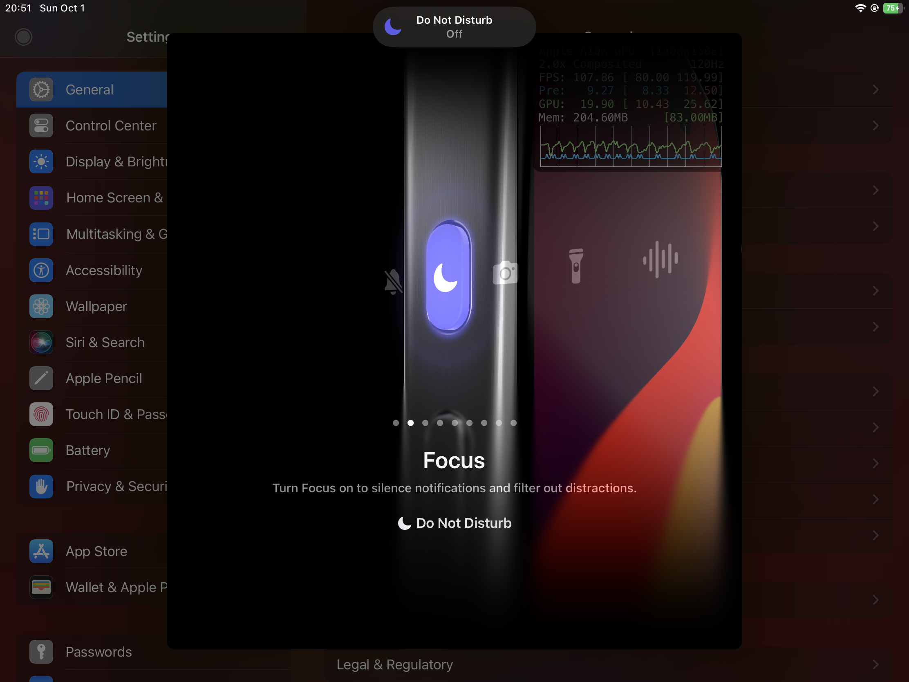

# ActionButtonEnabler

Enable Action Button on all devices!

**Requires iOS 17.0+.**

Your Home Button now acts as an Action Button. If you have devices that don't have a Home Button, use Assistive Touch.

